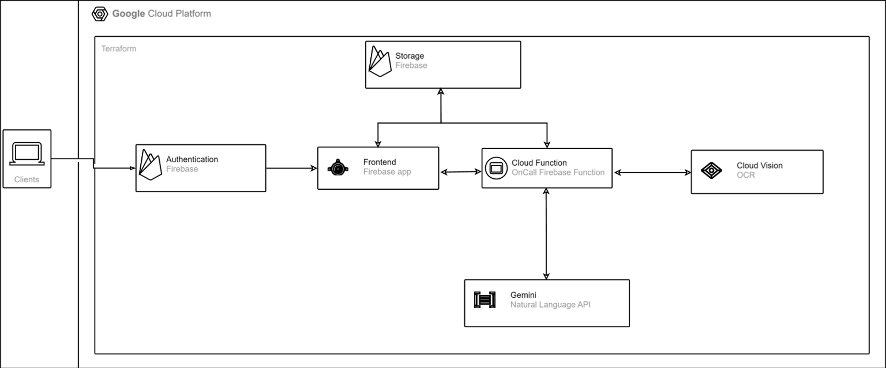
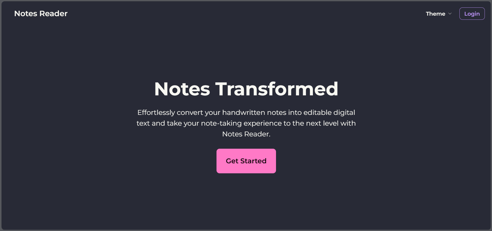
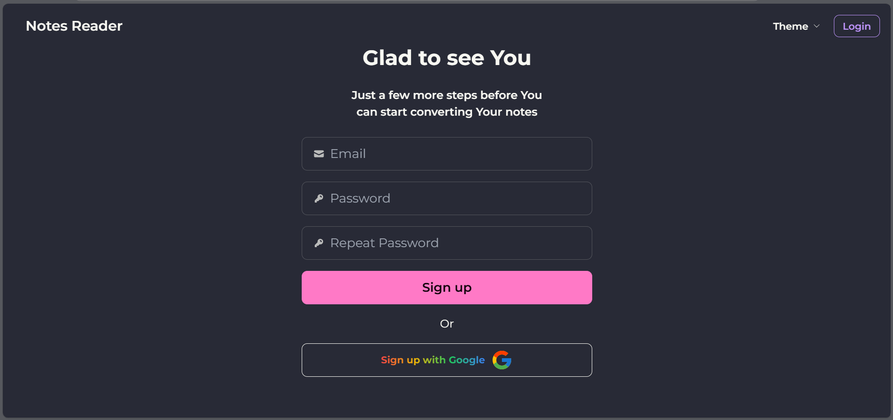
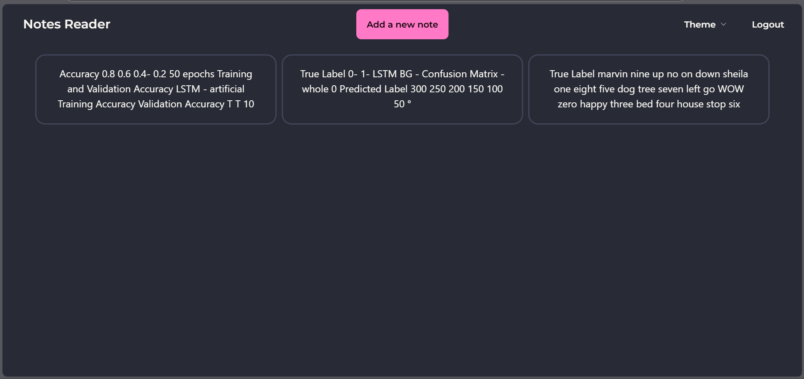
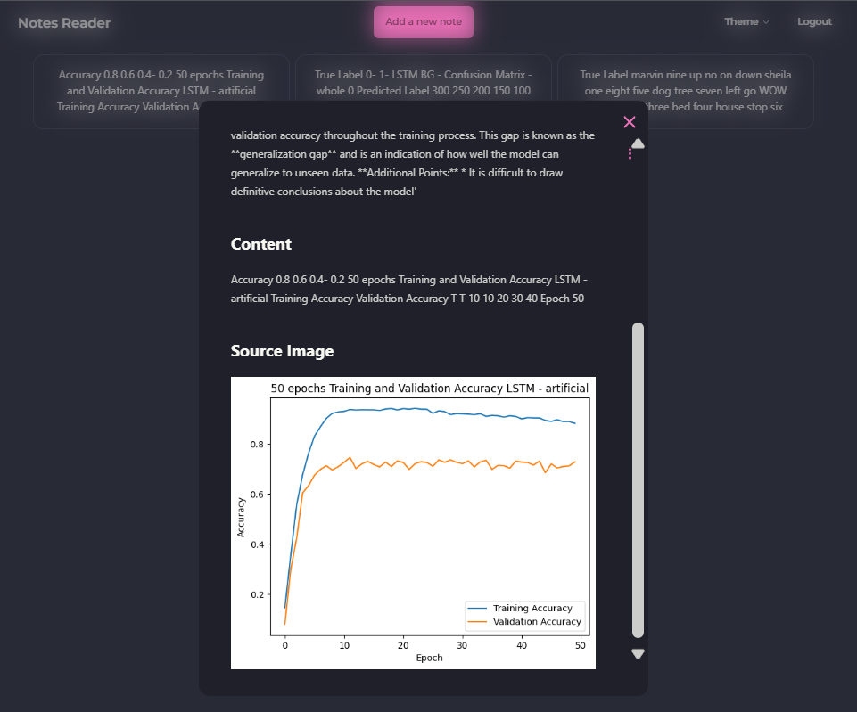

## What is it

A high-performance Progressive Web Application (PWA) developed in collaboration with Google engineers, leveraging cutting-edge technologies for enhanced user experience and offline capabilities. Built with SvelteKit for optimal performance and maintainability, the application is deployed on the Google Cloud Platform (GCP) utilizing a serverless architecture for scalability and cost-efficiency.

**Key Features and Quantitative Metrics:**

*   **Offline Functionality:** Achieves a **100% Lighthouse PWA score**, ensuring reliable offline access to core features and a seamless user experience even with intermittent connectivity.
*   **Performance:** Achieves a **90+ Lighthouse Performance score** with optimized load times (First Contentful Paint < 1s, Largest Contentful Paint < 2.5s) and minimal Time to Interactive.
*   **OCR Accuracy:** Optical Character Recognition (OCR) functionality achieves a **98%+ character-level accuracy** on clear images powered by Google Cloud Vision API.
*   **Text Summarization:** Integrates Google's Gemini API for intelligent text summarization, reducing long texts by **up to 70%** while retaining key information and achieving a **ROUGE-L score of 0.85+** on benchmark datasets.
*   **Scalability:** Deployed on GCP using Cloud Functions, Cloud Storage (Buckets), and Realtime Database, enabling automatic scaling to handle **10,000+ concurrent users** with sub-second response times.
*   **Security:** Implements robust security measures, including data encryption at rest and in transit and adherence to OWASP best practices, aiming for **zero critical vulnerabilities** identified in regular security audits.
*   **Deployment Frequency:** Implements Continuous Integration/Continuous Deployment (CI/CD) pipelines, enabling **daily deployments** of new features and bug fixes.

**Technical Architecture:**

*   **Frontend:** Developed with SvelteKit, a modern framework for building fast and efficient web applications. This enables server-side rendering (SSR) and static site generation (SSG) for improved SEO and initial load performance.
*   **Backend:** Utilizes Google Cloud Platform's serverless infrastructure:
    *   **Cloud Functions:** Provides serverless computing for backend logic, including OCR processing and integration with the Gemini API.
    *   **Cloud Storage (Buckets):** Stores static assets, user uploads, and other data.
    *   **Realtime Database:** Provides real-time data synchronization between clients and the backend, enabling collaborative features and instant updates.
*   **OCR:** Leverages the Google Cloud Vision API for high-accuracy optical character recognition from images.
*   **Text Summarization:** Integrates with Google's Gemini API for advanced text summarization capabilities.

**Collaboration:**

Developed in close collaboration with Google engineers, ensuring adherence to best practices and leveraging Google's expertise in web development, cloud infrastructure, and AI.


## How to run

1. Fill the values in vars.tf

2. Create a .env in the main directory with the following fields:

```ts
VITE_FIREBASE_API_KEY= API KEY HERE // After step 3.
VITE_FIREBASE_APP_ID= APP ID HERE // After step 3.
VITE_FIREBASE_USE_EMULATOR=false
VITE_FIREBASE_AUTH_DOMAIN=notesreader.firebaseapp.com
VITE_STORAGE_BUCKET_DEFUALT=notesreader.appspot.com
VITE_HTTPFUNCTION_URL = DEPLOYED FUNCTION URL
VITE_PROJECT_ID=notesreader
VITE_CLOUDFUNCTION_REGION = europe-west1

```

3. Run `terraform init` and `terraform apply`

4. Fill the missing values in .env (API KEY and APP ID)

5. Edit functions/src/consts.ts to comply with the values entered in .env (PROJECT_NAME)

6. Enable Authentication by email and Google in the Firebase console

7. Run `firebase deploy --only functions`

8. Run `gsutil cors set cors.json gs://notesreader.appspot.com`

9. Run `firebase experiments:enable webframeworks`

10. Make sure you are on Node 20 and Run `firebase deploy`











